###### Making a dashboard is not too difficult but how do you make a dashboard that's actually good?

## What makes a good dashboard?

A good dashboard is one that you can get the most information out of with the shortest glance. If you find yourself starting at a dashboard for minutes trying to figure out what it all means then you have some improvements to make.

## What kinds of metrics should I include?

The metrics you want depends on your specific use case but there are some metrics that are generally helpful for all KNS services.

- API metrics
  - incoming response times (by path/api version)
  - incoming error rates (by path/api version)
  - incoming request rates (by path path/version)
- Graphql API metrics
  - incoming response times (by query name)
  - error rates (by query name)
  - request rates (by query name)
- Dependency metrics
  - dependency health checks
  - outgoing request rates (by dependency)
  - outgoing request times (by dependency)
  - outgoing error times (by dependency)
- Instance metrics
  - number of instances
  - instance health
  - cpu (by instance)
- Node metrics
  - memory (by instance)
  - active handles (by instance)
  - event loop lag (by instance)
- Kafka metrics
  - consumer lag

## Percentiles

The most useful metric is often a percentile. A response time p95 (95th percentile) metric tells us that 95% of requests are served in X seconds or less. Using percentiles is much more useful than min/average/max as it gives us a better idea on the impact to the users.

### Percentiles in Datadog

In Datadog there is no supported way of doing percentiles for histograms like there is in Prometheus. To work around this we can get what is essentially the opposite of a percentile.
Instead of calculating p[99|95|75|50] -> X seconds we can get [0.5s|1s|2s|etc.] -> pX.

The way this works is by plotting the percentage of requests the fall into each bucket of the histogram.
We divide the number of requests in a specific bucket by the total number of requests (note: we should be using the +Inf bucket but there is a bug in Datadog and are forced to use the 10s bucket instead).
Below you can see two examples of such graphs.

This first graph has a line for several different histogram buckets. Hovering over a line we can see the percent of requests that complete in less than or equal to that time. E.g. in the picture we can see that 97.96% of requests happen in one second or less.
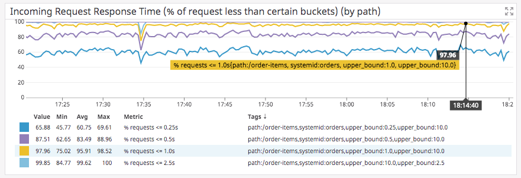

The graph is created by adding a query for each of the histogram buckets. You can then hide the queries themselves and add calculations which refer to thoses queries.
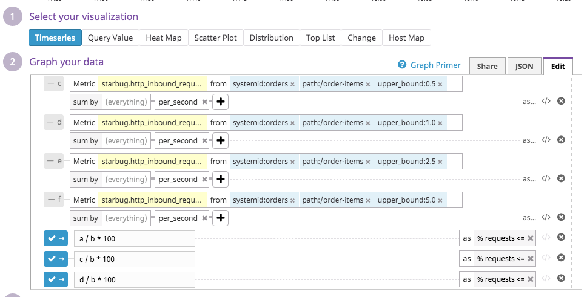

In this second example we can see a breakdown of the histogram buckets. Each section shows what percent of requests ended up in that bucket. Below you can see that 21.83% of requests were between 0.25 seconds and 0.5 seconds.
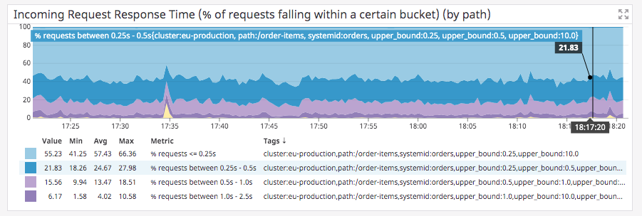

The graph is set up in the same way as the previous one but each calculation subtracts the previous buckets value.
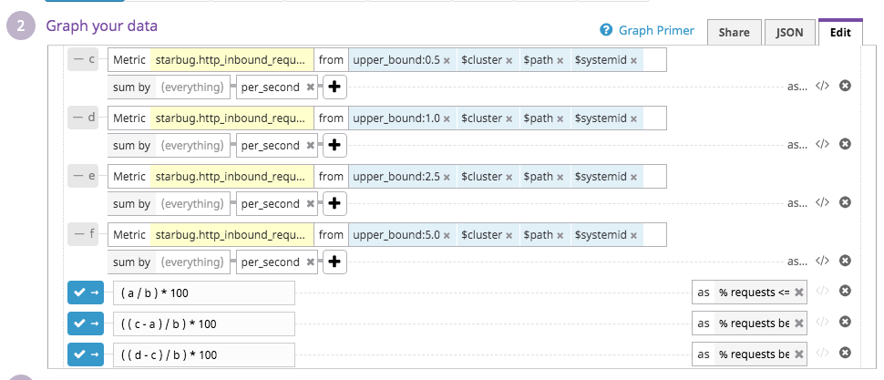

Both examples allow us to see fluctuations in our response times as well as monitor response time SLAs.

### Percentiles in Prometheus

In Prometheus you can make a graph using the histogram_quantile function.

An example of a p95 request duration query:

```js
histogram_quantile(0.95,
  sum by(job, namespace, service, le) (rate(gateway_http_request_duration_seconds_bucket[5m])))
```

## Parametized dashboards

Instead of creating a new dashboard for every one of your services and environments - make a parametized dashboard so that it can be reused.

### Parametized dashboards in Datadog

Datadog allows you to create variables in the top left corner of your dashboard. These variables will then show up as labels in your query or can be reference with $<VARIABLE_NAME>
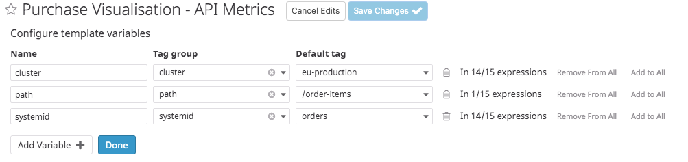

### Parametized dashboards in Grafana

Variables are created in Grafana in a similar way. Create them in the settings and refer to them with the $ sign.
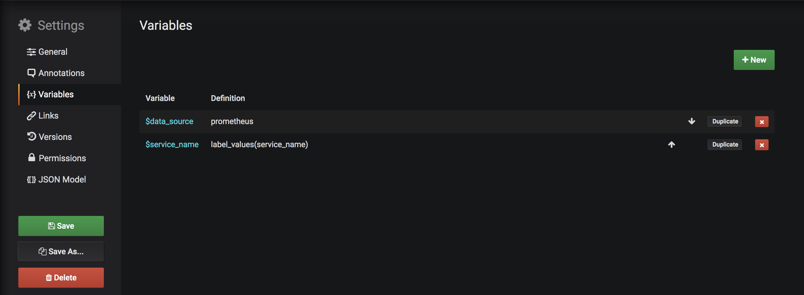

## How should I format my graphs?

The most important thing to think about when creating a graph is whether someone else can understand it at a glance. As a test, show your graph to one of your teams mate or a rubber duck and ask them to explain to you what it represents. If they have no idea then it's not a useful graph. Here are some useful rules:

### Proper title

All graphs should have a descriptive title that explains exactly what that graph shows.

#### Bad graph title:

    "Response times"

Response times for what? Incoming or outgoing requests? Is it a rate? Max? Average? Min? Percentile? Is it per second or per minute? Is it per path or a sum of all paths?

#### Better graph title:

    "Incoming request response time p99 by path (requests per second)"

## Legends

All graphs should display a legend. If you graph has data on it, then a legend is needed to explain what the data means.

### Legends in Datadog

It's as simple as ticking the box!
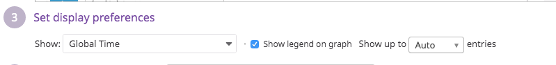

### Legends in Grafana

Add a legend text below each query line. You can use double curly braces {{}} in order to substitute in label values from your query.
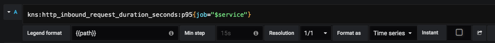

## Axis

Labelling your axis can give vital information that you may not be able to fit into your title.

### Axis labels in Datadog

As far as I know it's not possible to label your axis in Datadog :(

### Axis labels in Grafana

In the "Axes" tab you can add a right and left y-axis label.
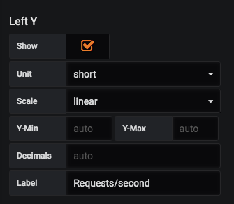

## Y-axis

In most cases your y-axis should have a minimum value of zero. If you have an automatic y axis then you may see a graph that fluctuates widely. However when you look more closely at the y-axis values you might see that the values only go between 120 and 120.5. Think about whether it's important to you to see the difference in such small fluctuations. If not then set your y-axis to zero always.

See the difference between a graph with no minimum y-axis:
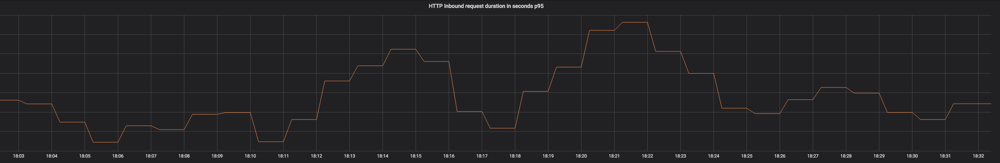

And one with a minimum y-axis of zero:
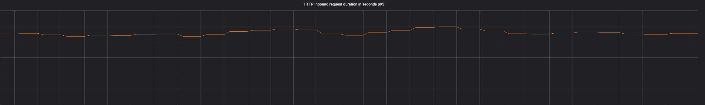

It's much easier to see that the fluctuations in data are not as significant as they seemed in the first graph.

The minimum-maximum y-axis can be equal confusing. If your y-axis grows and shrinks automatically you may end up with an error rate graph that shows huge big spikes but the values only go between 0 and 0.1. Think about what the minimum value you would consider to be interesting to see on a graph.

See the difference between a graph with no min-max y-axis:
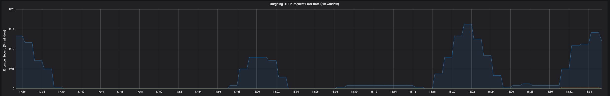

And one with a min-max y-axis of 10:


In the case above what looks like a hige spike of errors may actually be considered so small that it's not worth worrying about. It's important that when you see a big spike that it's actually meaningful.

### Min-max y-axis in Datadog

In Datadog you can add a marker to your graph so that the y-axis will be at least this value.

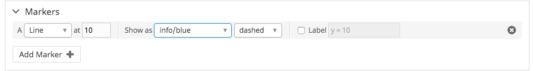

### Min-max y-axis in Grafana

This is a feature that's not exactly supported in Grafana so I use a hack to get around that.
You can add a new query line to your graph with a constant value (in the case above 10). Then you can add a series overide to that specific query to hide the legend, set the line fill and line width to 0.
Grafana will then set the y-axis to 10 by minimum but still allow the y-axis to grow if the actual data grows.

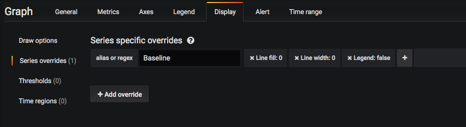
