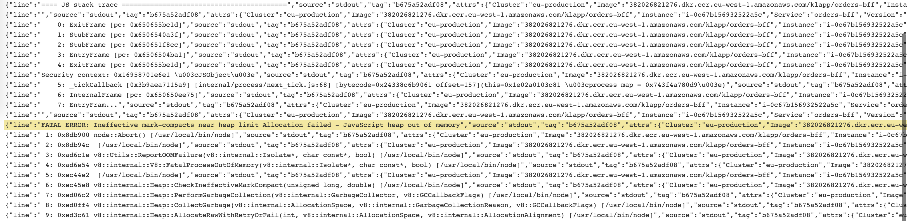

###### Memory leak? Grab a mop and some duck tape and let's get started.

## How do I know if my memory is leaking?

Well if you're reading this then there's a good chance you're here because you have a memory leak.
The reassuring news is that I also have a memory leak. In this post we'll take a look at how we found and fixed the leak as well as some tips for you to fix your own leak.

First thing's first, let's look at some metrics.


If your graphs look something like this then there's bad news - your memory is leaking down the back of the sink and destroying your wooden floors.

The key pattern to look for here is the memory increasing over time without ever going down to a level it was previously on. Spiky memory graphs are generally OK as long as they don't slowly (or rapidly!) increase over time.

Chances are your instances will be running out of memory and crashing. If you take a look in AWS you'll see your instances going up and down like yo-yos.


If you take a look at the 'last words' of one of your deceased instances you'll see some logs like these ones in Splunk.




> The 'last words' of an instance are the final logs your instance managed to write while it was on it's death bed. These are super useful for finding out why and instance died. Take the instance-id from the auto scaling group "Activity History" window for a terminated instance and search for it in Splunk. You'll then see the logs trail off and stop. Zoom-in to the final minute of logs to get to the interesting part.

## How do I find the cause of the leak?

### Step one: Refresh Your Memory About Memory in JavaScript

My first advice would be to take a quick refresher about JavaScript memory management.
Have a quick read through posts [like this one](https://javascript.info/garbage-collection).
Having a solid understanding about how memory and garbage collection works is going to help you identify the problem.

### Step Two: Reproduce the Leak

It's going to be very difficult to fix a leak if you can't reproduce it. Whilst you can deploy changes and try to collect data from a production environment your life is going to be easier if you can reproduce the leak locally.
In order to do this you'll need to:

1.  start your service locally
2.  smash it with requests
3.  monitor the memory and be on the lookout for the leak

The tool we're using for monitoring the memory is [node-clinic](https://github.com/nearform/node-clinic). This tool will start your service for you and the generates a graph of the memory usage.

Install it:

```js
npm install -g clinic
```

Use it:

```js
clinic doctor -- node src/index.js
```

_(replace `src/index.js` with wherever your entry point is)_

Once that's up and running let's give your service some work to do. We'll use [auto cannon](https://github.com/mcollina/autocannon) to send a bunch of requests.

Install it:

```js
npm install -g autocannon
```

Use it:

```js
autocannon -H "Authorization=Basic MY_BASIC_TOKEN" -a 1000 -c 10 "http://localhost:<MY_PORT>/<MY_PATH>"
```

_(Replace the token and path with sensible values)_

Depending on how bad your memory leak is you may need to run node clinic and auto cannon for quite some time in order to gather enough data.
You need a longer enough period of time in order for a pattern to emerge amongst the noise. I suggest at least 10 minutes but preferably more.

Once you've patiently waited or have grown impatient of waiting, stop auto cannon and `ctrl+c` the node clinic process. Node clinic will then start analysing the data and eventually open up a browser window with some fancy graphs. With any luck you'll see a memory graph like this. You'll notice that over time the memory is slowly creeping upwards.


Congratulations, you have a leak!

### Step Three: Collect and Analyse Memory Data

Tools like node clinic can be a good way to get an overview of metrics but in order to find the cause of the leak we need to get more detailed data. For this we'll use the chrome inspector.

Run your service with the inspect flag.

```js
node --inspect src/index.js
```

_(replace `src/index.js` with wherever your entry point is)_

Navigate to `chrome://inspect` in your browser.
You'll then see your locally running service under `Remote Target`


Click the target and you'll be taken to the Profiler. Select the `Memory` tab in the top and you'll see the following.


There are three different tools here and each can be useful. We'll talk about two of them: `Allocation instrumentation on timeline` and `Heap snapshot`.

#### Allocation instrumentation on timeline

Select the option `Allocation instrumentation on timeline` and click the box `Record allocation stacks`. Then click start.

As before we'll use auto cannon to send a large amount of requests to our locally running service. I recommend only starting auto cannon after the profiling has begun. That way you won't have a heap full of leaked objects when you start the recording.

Run the profiler for a period of time that gives you enough data. I recommend to run for at least a minute but longer may be helpful too depending on how often your leak happens.


Once you're happy that you have enough data. Stop the auto cannon and leave the recording on for another minute or so. The purpose of stopping auto cannon first is so that we can see if objects created for incoming requests are collected from the heap or not.

Click the stop button (red button to the left) and take a look at the data. By default you'll be in the `Summary` section. A tiny little drop down box near the top will let you change views.


The topmost window is a timeline window. Here we can see lines which represent memory being allocated.

The blue lines represent memory was still live in the heap at the time where we stopped the recording. If your timeline is full with large blue lines (the scale of the graph is particularly important and quite confusing as it changes rapidly during the course of the recording) then we can further verify that we have a leak.


The constructor window below the timeline has a list of all the objects that were in the heap at the end of the recording period.
Sometimes memory leaks an be caused by third party libraries or code not controlled by us. This would result in objects that we don't own being leaked.
Many times, however, the leak is caused by objects that we own. In the constructor window we can search for our objects and see how many were in the heap at the end of the recording.


What we want to look for are objects that have a large number next to them. In the below example you can see that one of our objects called `TransactionService` is in the heap 97 times!
This object is created for every request and attached to the request object. We definitely do not expect 97 of them to still be in the heap at the end of the recording.
Bingo! We've found a lead.
We can also see that there are many objects that are being leaked: `DataLoader`, `Promise`, `ServerResponse`, etc.

The last window is the `Retainers` window. If you select an object from the Constructors window then you can see which objects are retaining it. This is a good way to go through a chain of objects to find the root cause of the leak.


#### Heap snapshot

The other tool provided by the inspector is the heap snapshotter. This tool can be useful to compare multiple heap snapshots. A common practice is the following:

1.  Start your server
2.  Take a heap snapshot
3.  Perform an action (run the auto cannon for a period of time)
4.  Take another snapshot
5.  Perform further actions (continue to run the auto cannon for longer)
6.  Take another snapshot

Once you have multiple snapshots you can select the `Compare` option compare the current one with the previous.


This gives us some useful statistics - namely the object count delta.


If we sort by the `# Delta` column then we'll get the objects that changed the most. The objects that have a delta are not necessarily leaked objects but if the delta continues to rise over time without negative deltas bring the number down again then that's a sign of a leaked object.

Again we can see the same objects from our allocation recording. These objects always have a positive delta and the number increased steadily.

With these tools you should be able to get a good idea about exactly what objects are being leaked and what objects are retaining references to them.

## How do I fix the leak?

This is going to be the most disappointing section of this post.
Fixing the leak depends entirely on what's causing it.
The good news is that once you've found out what data is leaking, figuring out the fix is usually the easiest part.

In the case from the screenshots above the objects that were being leaked were all retained by the `req` object. This showed us that the `req` object itself was being leaked. The caused turned out to be [a bug in Node version 10.15](https://github.com/nodejs/node/pull/25993) which happens if there are promises attached to the `req` object. We had an object chain that looked like req -> service object -> data loader. The data loader object contains a map of promises ([see the source here](https://github.com/graphql/dataloader/blob/master/src/index.js)) in order to delay fetching till the next tick of the event loop. This causes a circular reference that JS does not detect (see more details [here](https://github.com/nodejs/node/pull/25993)).

Once you make your change, follow the procedure above to profile your service and check that the leak has been fixed.
