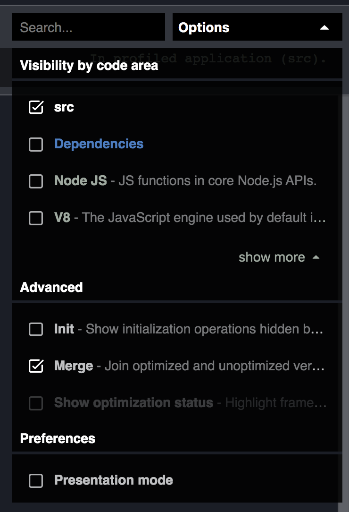
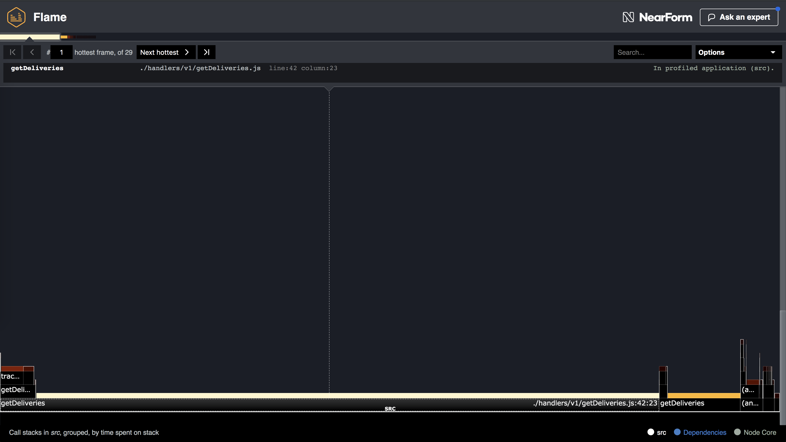
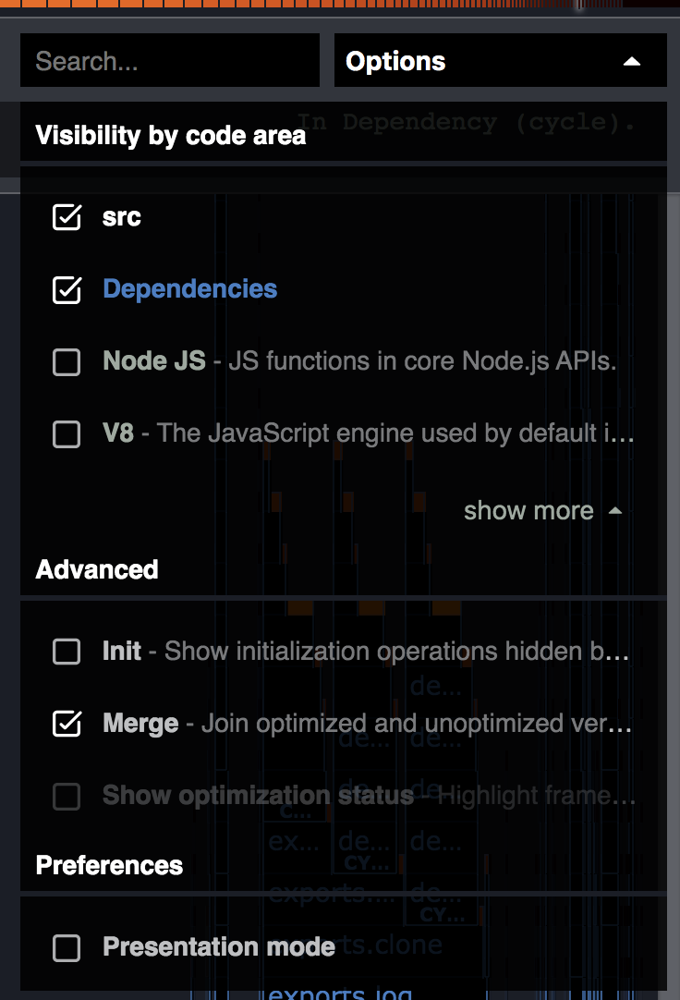
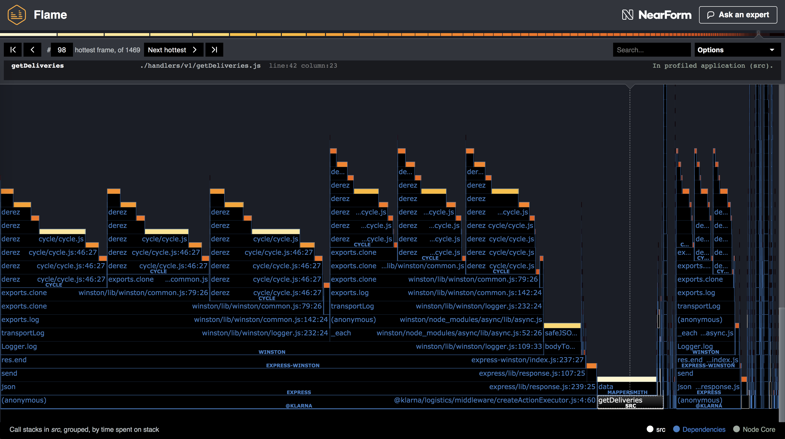
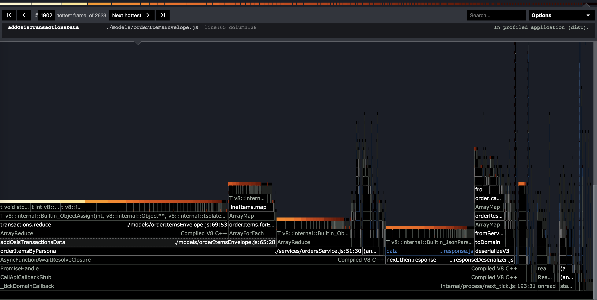

###### Is your service performing badly? Got event loop lag? Slow outgoing requests that exceed your timeouts? Flame graphs to the rescue!

## What is a flame graph?

Flame graphs help to uncover the bottlenecks and hot paths in your code. They allow you to identify the most frequent code paths at a glance.
A flamegraph shows two things: the amount of time that a function was on CPU and the amount of time that a function was on the top of the call stack.
The X axis of a flame graph represents the "hotness" of a function and the Y axis shows the callstack of the function.

## What kind of performance issues can I find using flame graphs?

Flame graphs are great for finding problems with event loop lag. If you have event loop lag then your entire service will perform poorly.
Response times will be slow (often surpassing timeouts you have), active handles will be high, and CPU will spike.
If the problem is bad enough your service may even stop responding to health checks quickly enough and be killed off by the load balancer.

> "But my service is so simple! It's barely doing anything! It couldn't possible have event loop lag issues!"

Unfortunately even the simplest of service can have issues with event loop lag. The issue may even be coming from a dependency. Best to investigate further before ruling it out.

## How do I create a flame graph?

Node Clinic is a great tool to create flame graphs. Ideally we want to be able to create a flame chart of a production or production like enviroment.
However, I've often found that starting off by running your service locally works best. It's often possible to find issues locally before resorting to anything more difficult.

What you'll need to do is to run your service locally (have it set up with some sensible data if needed), smash it with heaps of requests, and profile it at the same time.

1.  Install Node Clinic:

```
npm install -g clinic
```

2.  Run your service using Node Clinic:

```
clinic flame -- node src/index.js
```

3.  Install Autocannon:

```
npm install -g autocannon
```

4.  Smash your service:

```
autocannon -H "Authorization=<INSERT AUTH TOKEN HERE>" -a 1000 -c 10 "http://localhost:<PORT>/<PATH>"
```

Replace the values in brackets with sensible values.

The `-a 1000` means to send 1,000 requests and the `-c 10` is 10 concurrent connections. You may need to change these values depending on how fast/slow your API is and how much data you want to collect.

5.  Stop your service (`ctrl+c`) and Node Clinic will generate a flame graph and open it automatically in your browser.

## How do I read my flame graph?

The flame graph itself can be very overwhelming to read and at first glance you may be totally lost. Let's break it down.

The Y axis shows the call stack for each function in the graph. Stacks that are realy, really tall show code paths that involve a lot of fucntion calls.

The X axis is where the gold is. The width of each section shows the amount of time the function was on the CPU for.
If a certain section is taking up half of the width of the graph then during the whole time that your service was running, that function was on the CPU for half the time.
If a section is taking up 90% of the width of the screen then 90% of the time spent was running that function!

The color indicates the "hotness".
The hottest sections spent the most time on the top of the stack.
Another way of seeing this is: for how long was a function blocking the event loop.

What you should be looking for here are sections that are very wide and/or very hot.
If there's one or two sections that are a lot wider and hotter than the rest then it's likely that there's something wrong happening.

When you open a flame graph it helps to remove some of the data so that you can focus on one thing at a time.
In the top right corner you can see an options drop down. Here you can select the visibilty by code area.

Unselect all options so that the only selected option is `src`



Now the graph will only show functions that are inside of your own source code.

## Examples

Let's look at some examples to make it clearer.

### 1. A problem in a dependency

Take a look at the following flame graph:



You should have noticed that the hottest section is VERY hot. It takes up around 75% of the total width!
This definitely seems like it could be a problem. Let's focus on this section and find out what's happening.

The next thing you should have noticed is that the section has only a single visible function. This means that it's the end of the call stack within our src. Let's go to the options and enable dependencies.



Now we can see the rest of the callstack.



The hottest section now is the function `data` in the `mappersmith` package.
This is pretty understandable. When we call the `data` method then Mappersmith is going to parse the JSON response for us.
If we're dealing with large amounts of JSON then we'd expect the data section to be hot.

But the widest section by far is a function called `createActionExecutor`.
As we follow the stack upwards we see that we end up in the express-winston package but the section is still super wide.
Something that express-winston is doing is taking a LONG time!

The answer here is that the service is simply logging too much.
The service was logging massive logs which need to be parsed and written.
Changing the logging so that it's only logging the necessary bits and re-running the experiment results in `express-winston` section dissapearing almost entirely from the flame graph. Great!

### 2. A problem in V8 (OK a problem in src that manifests in V8)

Let's look at another example:



Here we can see the one of the widest sections is one called `orderItemsByPersona`.
I've enabled the V8 code visibility in the options drop down.

Following the stack trace upwards we can see that the cause is a reduce function that ends up calling the internal ObjectAssign method.
Let's take a look at the code on that line:

```js
const transactionsMap = transactions.reduce(
  (acc, transaction) => ({
    ...acc,
    [transaction.id]: transaction
  }),
  {}
);
```

Seems innocent enough. Unfortunately the transactions array can be LARGE.
Because of the spread operator we're continuously creating new objects.
In this case, ditching the spread operator fixes the issue and speeds things up a lot.

## Summary

Generating flame graphs is a great way to identify performance bottlenecks in your code.

Look for the hottest or widest sections to find areas of improvement.
Use the options to dive deeper into dependencies, Node, or V8 to figure out what functions are causing the issue.

Don't forget to generate a new flamge graph to verify that your fix has helped. A healthy flame graph should have a range of oranges and yellows and no longer be dominated by just one function.
